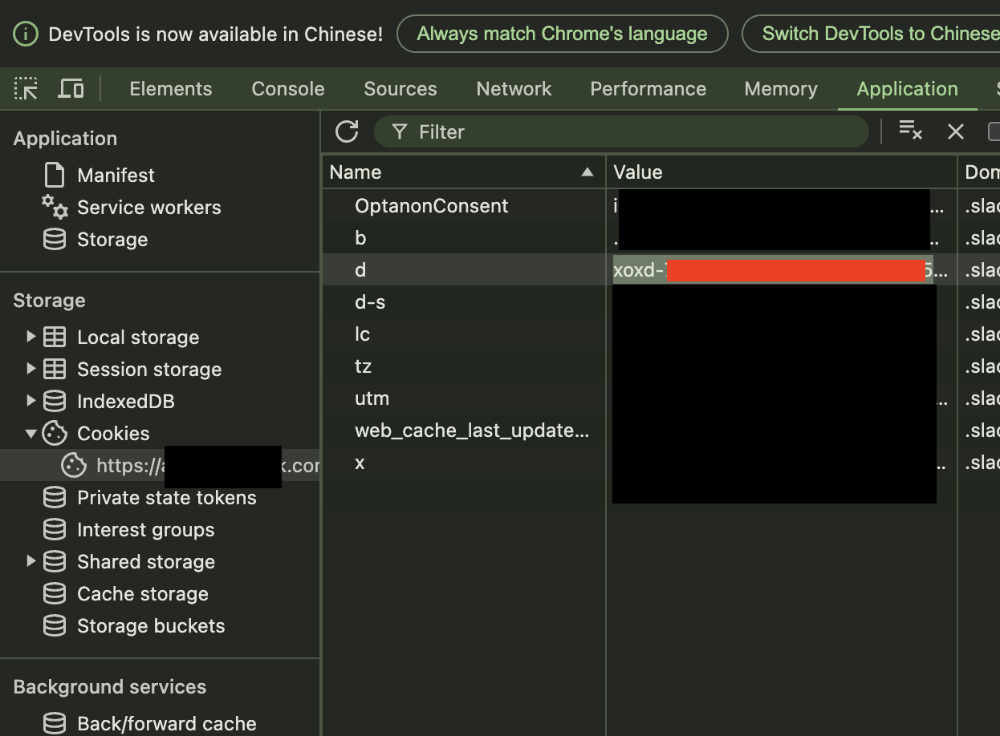

`request: [POST]emoji.adminList`
Please Go to **https://{{WORKSPACE}}/customize/emoji** to get the information for upload/delete emoji.
# Token 
1. Open `Dev tools` in browser
2. Go to `Network` tab
3. Refresh **https://{{WORKSPACE}}/customize/emoji**
4. Find a request called `emoji.adminList`
5. Go to `Payload` informaion
6. Copy `token` from **form-data**
7. Paste the value to set **TOKEN** in `.env`.

# Cookie
1. Open `Dev tools` in browser
2. Go to `Application` tab
3. Refresh **https://{{WORKSPACE}}/customize/emoji**
4. Get the cookies
5. copy the value for key named is `d`
6. Paste the value to set **COOKIE_D** in `.env`.
